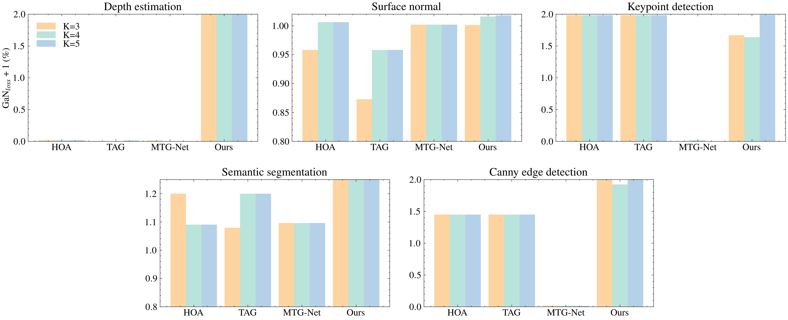

# Comparison to STL
<!--  -->

<!--| Groups | Methods | Depth Estimation Loss $\downarrow$ | Depth Estimation NormGain$_L$ (\%) $\uparrow$ | Surface Normal Loss $\downarrow$ | Surface Normal NormGain$_L$ (\%) $\uparrow$ | Semantic Segmentation Loss $\downarrow$ | Semantic Segmentation NormGain$_L$ (\%) $\uparrow$ | Keypoint Detection Loss $\downarrow$ | Keypoint Detection NormGain$_L$ (\%) $\uparrow$ | Edge Detection Loss $\downarrow$ | Edge Detection NormGain$_L$ (\%) $\uparrow$ |
|---------------------|--------------------|-----------------------------|---------------------------------------|---------------------------|-------------------------------------|------------------------------------------|------------------------------------------------|--------------------------------|-----------------------------------------|---------------------------|------------------------------------|
|                       | STL                | 1.60e-5                     | -                                 | 1.07e-1                   | -                                   | 9.16e-2                                    | -                                              | 1.30e-4                        | -                                           | 1.56e-4                   | -                                     |
| $K=3$               | RG                 | 2.57e-2                     | -160212.50                         | 1.08e-1                   | -0.63                               | 8.43e-2                                    | 7.9                                            | 6.87e-3                        | -5181.54                                   | 6.88e-3                   | -4308.33                            |
|                       | HOA              | 5.85e-3                     | -36487.50                          | 1.11e-1                   | -4.18                               | 7.33e-2                                    | +19.99                                        | **2.00e-6**              | **+98.46**                       | 8.60e-5                   | +44.87                               |
|                       | TAG               | 5.15e-3                     | -32087.50                          | 1.21e-1                   | -12.73                              | 8.43e-2                                    | +7.90                                         | **2.00e-6**              | **+98.46**                       | 8.60e-5                   | +44.87                               |
|                       | MTG-Net       | 2.04e-4                     | -1175.00                           | **1.07e-1**  | **+0.18**             | 8.28e-2                                    | +9.61                                         | 6.39e-4                        | -391.54                                   | 4.08e-4                   | -161.54                              |
|                       | Ours             | **1.19e-7**   | **+100.00**          | 1.07e-1                   | +0.13                              | **6.65e-2**                   | **+27.36**                      | 4.30e-5                        | +66.92                                    | **3.58e-7**      | **+100.00**                 |
| $K=4$               | RG                 | 5.15e-3                     | -32087.50                          | 1.07e-1                   | +0.18                               | 7.33e-2                                    | +19.99                                        | 1.19e-2                        | -9079.23                                   | 6.88e-3                   | -4308.33                            |
|                       | HOA              | 5.15e-3                     | -32087.50                          | 1.06e-1                   | +0.62                               | 8.33e-2                                    | +9.05                                         | **2.00e-6**              | **+98.46**                       | 8.60e-5                   | +44.87                               |
|                       | TAG               | 5.15e-3                     | -32087.50                          | 1.11e-1                   | -4.18                               | 7.33e-2                                    | +19.99                                        | **2.00e-6**              | **+98.46**                       | 8.60e-5                   | +44.87                               |
|                       | MTG-Net       | 2.04e-4                     | -1175.00                           | 1.07e-1                   | +0.18                               | 8.28e-2                                    | +9.61                                         | 6.39e-4                        | -391.54                                   | 4.08e-4                   | -161.54                              |
|                       | Ours             | **1.19e-7**   | **+100.00**          | **1.05e-1**     | **+1.60**              | **6.46e-2**                    | **+29.46**                        | 4.70e-5                        | +63.85                                    | **1.20e-5**      | **+92.31**                   |
| $K=5$               | RG      | 5.15e-3        | -32087.50        | 1.07e-1          | +0.18          | 7.33e-2          | +19.99          | 6.87e-3          | -5181.54        | 6.88e-3          | -4308.33         |
|                        | HOA     | 5.15e-3        | -32087.50        | 1.06e-1          | +0.62          | 8.33e-2          | +9.05           | 2.00e-6          | +98.46          | 8.60e-5          | +44.87           |
|                        | TAG     | 5.15e-3        | -32087.50        | 1.11e-1          | -4.18          | 7.33e-2          | +19.99          | 2.00e-6          | +98.46          | 8.60e-5          | +44.87           |
|                        | MTG-Net | 2.04e-4        | -1175.00         | 1.07e-1          | +0.18          | 8.28e-2          | +9.61           | 6.39e-4          | -391.54         | 4.08e-4          | -161.54          |
|                        | Ours    | **1.19e-7** | **+100.00** | **1.05e-1** | **+1.80** | **6.34e-2** | **+30.78** | **1.00e-6** | **+99.23** | **4.17e-7** | **+100.00** |-->
