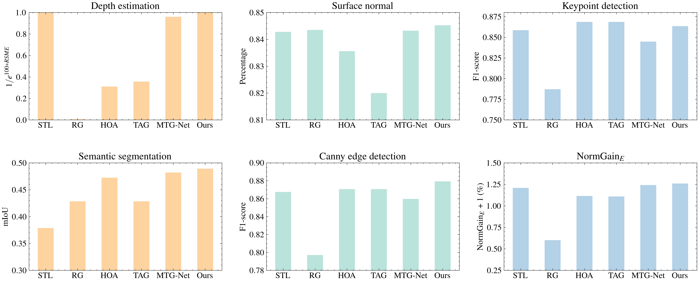
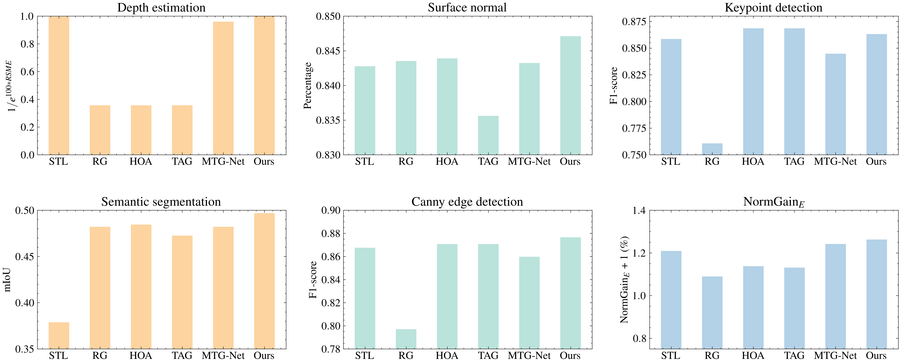
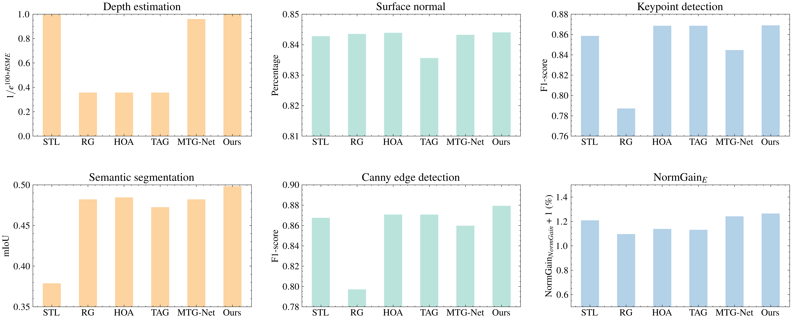

<!--# Evaluation error on Taskonomy-5 when K=3 -->
<!--  -->

<!--# Evaluation error on Taskonomy-5 when K=4 -->
<!-- -->

<!--# Evaluation error on Taskonomy-5 when K=5 -->
<!-- -->

| Groups | Methods   | Depth Estimation | NormGain$_E$ (\%) | Surface Normal (\%) | NormGain$_E$ (\%) | Semantic Segmentation (\%) | NormGain$_E$ (\%) | Keypoint Detection (\%) | NormGain$_E$ (\%) | Edge Detection (\%) |  NormGain$_E$ (\%)     |
|--------|-----------|------------------|----------|----------------|----------|-----------------------|----------|--------------------|----------|----------------|----------|
|        | Naive MTL | 8.67E-03         | -        | 84.32          | -        | 48.21                 | -        | 76.08              | -        | 76.56          | -        |
|        | STL       | 1.59E-05         | 99.82    | 84.28          | -0.05    | 37.88                 | -21.44   | 85.86              | 12.86    | 86.75          | 13.31    |
| K=3    | RG        | 2.57E-02         | -195.87  | 84.35          | 0.03     | 42.84                 | -11.13   | 78.71              | 3.47     | 79.71          | 4.11     |
|        | HOA       | 5.85E-03         | 32.48    | 83.56          | -0.90    | 47.25                 | -1.99    | **86.86**              | **14.17**    | 87.07          | 13.73    |
|        | TAG       | 5.15E-03         | 40.59    | 82.00          | -2.76    | 42.84                 | -11.13   | **86.86**              | **14.17**    | 87.07          | 13.73    |
|        | MTG-Net   | 2.04E-04         | 97.65    | 84.32          | 0.00     | 48.21                 | 0.00     | 84.47              | 11.04    | 85.98          | 12.30    |
|        | Ours      | **1.19E-07**         | **100.00**   | **84.52**          | **0.24**     | **48.93**                 | **1.50**     | 86.34              | 13.50    | **87.94**          | **14.86**    |
| K=4    | RG        | 5.15E-03         | 40.59    | 84.35          | 0.03     | 48.21                 | 0.00   | 76.08              | 0.00     | 79.71          | 4.11     |
|        | HOA       | 5.15E-03         | 40.59    | 84.39          | 0.08     | 48.46                 | 0.51     | **86.86**              | **14.17**    | 87.07          | 13.73    |
|        | TAG       | 5.15E-03         | 40.59    | 83.56          | -0.90    | 47.25                 | -1.99    | **86.86**              | **14.17**    | 87.07          | 13.73    |
|        | MTG-Net   | 2.04E-04         | 97.65    | 84.32          | 0.00     | 48.21                 | 0.00     | 84.47              | 11.04    | 85.98          | 12.30    |
|        | Ours      | **1.19E-07**         | **100.00**   | **84.71**          | **0.46**     | **49.69**                 | **3.08**     | 86.31              | 13.46    | **87.65**          | **14.49**    |
| K=5    | RG        | 5.15E-03         | 40.59    | 84.35          | 0.03     | 48.21                 | 0.00   | 78.71              | 3.47     | 79.71          | 4.11     |
|        | HOA       | 5.15E-03         | 40.59    | 84.39          | 0.08     | 48.46                 | 0.51     | 86.86              | 14.17    | 87.07          | 13.73    |
|        | TAG       | 5.15E-03         | 40.59    | 83.56          | -0.90    | 47.25                 | -1.99    | 86.86              | 14.17    | 87.07          | 13.73    |
|        | MTG-Net   | 2.04E-04         | 97.65    | 84.32          | 0.00     | 48.21                 | 0.00     | 84.47              | 11.04    | 85.98          | 12.30    |
|        | Ours      | **1.19E-07**         | **100.00**   | **84.40**          | **0.09**     | **49.85**                 | **3.40**     | **86.90**              | **14.23**    | **87.94**          | **14.86**    |
