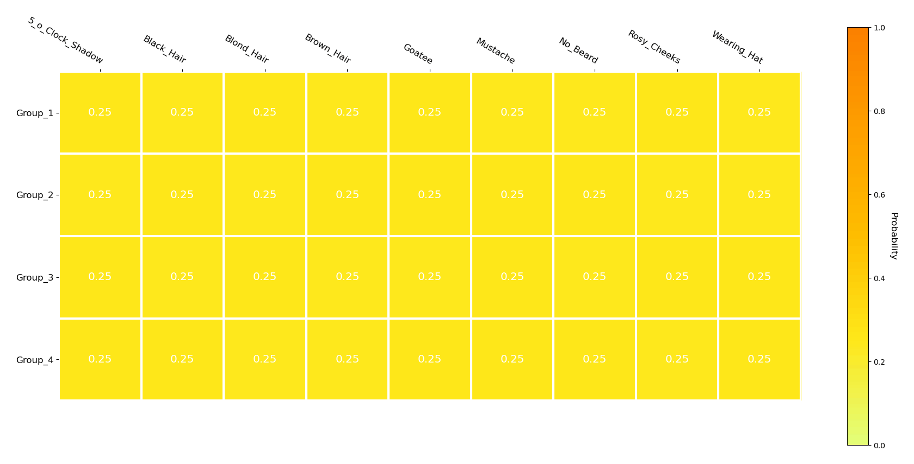

# DMTG: One-Shot Differentiable Multi-Task Grouping
This is a demo showing the dynamic grouping process of tasks of our proposed DMTG method on CelebA-9, CelebA-40, and Taskonomy-5 datasets. 
## Task grouping on CelebA-9.

## Task grouping on CelebA-40.

